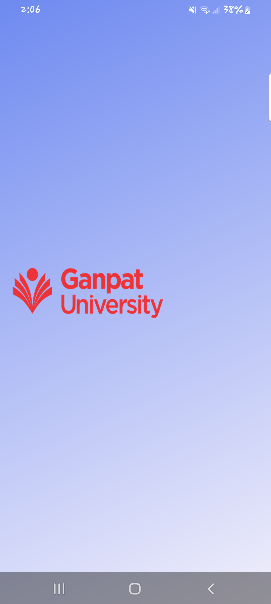
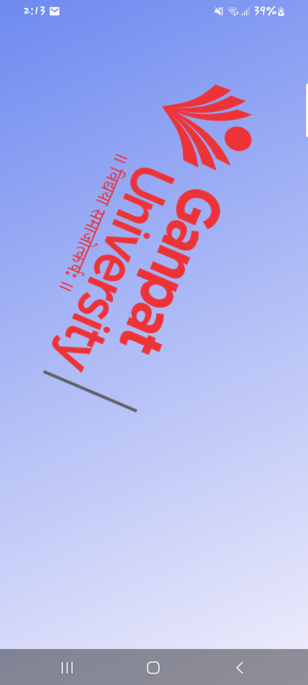
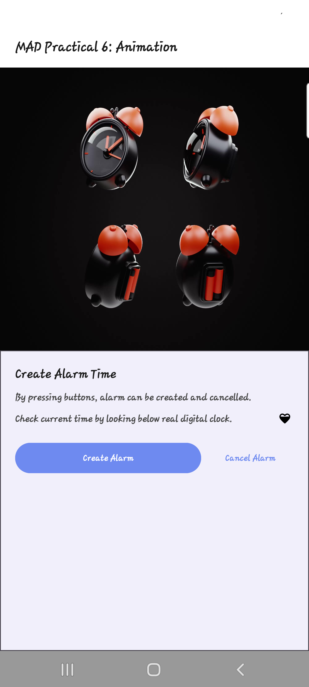
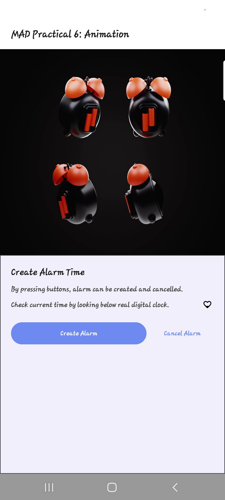

# Practical-6: Frame by Frame Animation & Twin Animation

## 👤 Author

**Name:** Nihal Shah  
**Enrollment No.:** 24012011175

---

## 🎯 Aim

To create an Android application to demonstrate **Frame by Frame Animation** and **Twin Animation** using Android animation techniques.

---

## 📖 About the Practical

This practical demonstrates animation concepts in an Android application.

### 1. Frame by Frame Animation

Frame by Frame Animation displays a sequence of images one after another at a fixed time interval to create an animation effect.

In this application, frame animation is used for:

- **UVPCE Logo** — 8 frames
- **Alarm Animation** — 10 frames
- **Heart Animation** — 5 frames

### 2. Twin Animation

Twin animation demonstrates multiple animation effects together to create a visual transformation effect.

The splash screen displays the UVPCE logo with animation before opening the main alarm screen.

---

## 📱 Application Screens

The application consists of two main screens:

### Splash Screen

The splash screen displays the UVPCE/Ganpat University logo using 8 frames.

The background uses a **blue-to-pink gradient**.

The logo frames change automatically to create the frame-by-frame animation.

### Alarm Screen

The main screen contains:

- Animated alarm clock
- Animated heart
- Current digital time
- Create Alarm button
- Cancel Alarm button
- Time Picker
- Alarm scheduling
- Alarm cancellation
- Light and Dark mode support

---

## 🛠️ Concepts & Components Used
- `ImageView`
- `AnimationDrawable` (Frame by Frame Animation)
- `Animation` / `AnimationUtils` (Twin Animation)
- `Animation.AnimationListener` (`onAnimationStart`, `onAnimationEnd`, `onAnimationRepeat`)
- `onWindowFocusChanged()` method — used to correctly start `AnimationDrawable` after the view is attached to the window
- `<animation-list>` — frame sequence with `android:oneshot` attribute (`true` for the splash logo, `false` for the looping alarm and heart)
- `<set>` tag with `<translate>`, `<rotate>`, `<scale>` tags for twin animation
- `enableEdgeToEdge()` — Immersive Mode / Edge to Edge display
- `WindowInsetsCompat` — handling system bar insets manually
- `<gradient>` tag inside `<shape>` — radial gradient background for splash screen
- `ConstraintLayout` — used for all screen layouts
- `MaterialCardView` — used for the info card on the main screen
- `Intent` — navigation from `SplashActivity` to `MainActivity`

---

## 📱 Output

### 🎬 Demo Video

[<video src="https://github.com/user-attachments/assets/3fbaf0cb-348e-454e-af34-1090a8b99735" controls width="320"></video>](https://github.com/user-attachments/assets/3fbaf0cb-348e-454e-af34-1090a8b99735)

### 🖼️ Screenshots

#### Splash Screen (Twin Animation + Frame by Frame)

<table>
  <tr>
    <td width="33%"></td>
    <td width="33%"></td>
    <td width="33%"></td>
  </tr>
  <tr>
    <td align="center">Animation Start</td>
    <td align="center">Rotate + Scale Up</td>
    <td align="center">Animation End</td>
  </tr>
</table>

#### Main Screen (Frame by Frame Animation)

<table>
  <tr>
    <td width="33%"></td>
    <td width="33%"></td>
  </tr>
  <tr>
    <td align="center">Alarm Frame 1</td>
    <td align="center">Alarm Frame 2</td>
  </tr>
</table>

---

